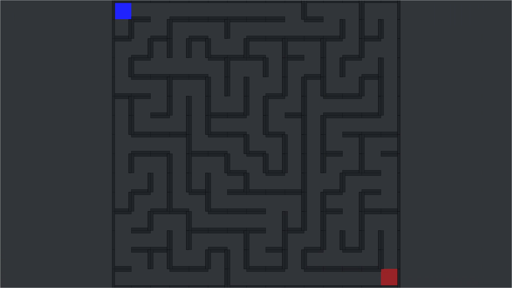

# Maze NEA 🧩
Visualized maze generator and solver



---

## 🚀 Features

- 🧱 Procedural maze generation using depth-first search (recursive backtracking)
- 🔍 Real-time maze solver visualizer
- 🎨 Responsive design that adjusts to window size
- ✅ Cross-platform

---

## 📸 Keyboard Shortcuts

| Action         | Keybind     |
|----------------|-------------|
| Solve Maze     | `X`         |
| Clear Path     | `C`         |
| Regenerate     | `R`         |
| Show/Hide Menu | `Esc`       |
| Resize Width   | ← / →       |
| Resize Height  | ↑ / ↓       |

---
## 📁 Project Structure
```bash
src
├── Assets
│   └── Backrooms_model.ico
├── GUI
│   ├── center_frame.py
│   ├── gui.py
│   ├── __init__.py
│   ├── left_frame.py
│   ├── right_frame.py
│   └── settings.py
├── main.py
└── Maze
    ├── maze.py
    └── solver.py
```
---

## 🛠 Installation

### 🔧 Requirements

- Python 3.10+
- `tkinter` (library usually pre-installed with Python)

### 📦 Run the app

```bash
git clone https://github.com/Daniel-Cocos/maze-nea.git
cd maze-nea/src
python3 main.py
